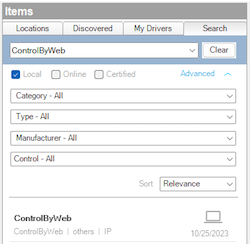

---

# Overview

> DISCLAIMER: This software is neither affiliated with nor endorsed by either
> Control4 or ControlByWeb®.

Easily integrate ControlByWeb® controllers into Control4. All ControlByWeb®
products have built-in web servers and can be setup, monitored, and controlled
using a web browser. In addition, products can be monitored and controlled using
custom computer applications as well as our CBW Mobile app for smartphones and
tablets.

# System requirements

- Control4 OS 3.3+

# Features

- Local network communication requiring no cloud services
- Support for the following via Control4 proxies:
  - Relays
  - Contact Sensors
  - Temperature Sensors
- Variable Programming Support

# Verified Compatible Devices

> If you try this driver on a product not listed below and it works, let us
> know!

- [X-410](https://www.controlbyweb.com/x410/)

# Driver Setup

Driver installation and setup is similar to most other cloud based drivers.
Below is an outline of the basic steps for your convenience.

1. Download the `control4-controlbyweb.zip` from the
   [latest GitHub release](https://github.com/black-ops-drivers/control4-controlbyweb/releases/latest).
2. Extract and
   [install](<(https://www.control4.com/help/c4/software/cpro/dealer-composer-help/content/composerpro_userguide/adding_drivers_manually.htm)>)
   the `controlbyweb.c4z` driver.
3. Use the "Search" tab to find the "ControlByWeb" driver and add it to your
   project.

   > ⚠️ Only a **_single_** controller driver instance is required per
   > ControlByWeb module.

   

4. Configure the [Module Settings](#module-settings) with the connection
   information.
5. After a few moments the [`Driver Status`](#driver-status-read-only) will
   display `Connected`. If the driver fails to connect, set the
   [`Log Mode`](#log-mode--off--print--log--print-and-log-) property to `Print`
   and re-set the [`IP Adress`](#email) field to trigger a reconnect. Then check
   the lua output window for more information.

## Driver Properties

### Cloud Settings

#### Automatic Updates

Turns on/off the GitHub cloud automatic updates.

#### Update Channel

Sets the update channel for which releases to consider during an automatic
update from the GitHub repo releases.

### Driver Settings

#### Driver Status (read only)

Displays the current status of the driver.

#### Driver Version (read only)

Displays the current version of the driver.

#### Log Level [ Fatal | Error | Warning | **_Info_** | Debug | Trace | Ultra ]

Sets the logging level. Default is `Info`.

#### Log Mode [ **_Off_** | Print | Log | Print and Log ]

Sets the logging mode. Default is `Off`.

### Module Settings

#### IP Address

Sets the module IP address (eg. `192.168.1.30`). Domain names are allowed as
long as they can be resolved to an accessible IP address by the controller.
HTTPS is not supported.

> ⚠️ If you are using an IP address you should ensure it will not change by
> assigning a static IP or creating a DHCP reservation.

##### Username

Sets the module username. Default is `admin`.

##### Password

Sets the module password. Default is `webrelay`.

## Driver Actions

### Update Drivers

Trigger the driver to update from the latest release on GitHub, regardless of
the current version.

# Support

If you have any questions or issues integrating this driver with Control4 you
can file an issue on GitHub:

https://github.com/black-ops-drivers/control4-controlbyweb/issues/new

# Changelog

[//]: # "## v[Version] - YYY-MM-DD"
[//]: # "### Added"
[//]: # "- Added"
[//]: # "### Fixed"
[//]: # "- Fixed"
[//]: # "### Changed"
[//]: # "- Changed"
[//]: # "### Removed"
[//]: # "- Removed"

## v20240117 - 2024-01-17

### Changed

- Changed the behavior of binding and variable notifications to only trigger
  when the value changed from the last known state. This helps to avoid spamming
  the history with duplicate events.

## v20231115 - 2023-11-15

### Fixed

- Fixed an issue with inconsistent binding order that would occasionally cause
  connections to reset.

## v20231025 - 2023-10-25

### Added

- Initial Release
